 

  

 

## `▸` Projects

**[HCR](https://pypi.org/project/hcr-memory/)** — *Cognitive Middleware for AI Development*

Persistent cognitive memory layer for AI-assisted development. Captures developer context via git hooks, stores it as structured Cognitive State Objects with causal graphs, and injects context into any MCP-compatible IDE. Published on PyPI. **907 tests passing.**

`Python` `FastAPI` `Supabase` `MCP` `React` `sqlite-vec`

---

**Corvus** — *Visual Multi-Agent AI Development Platform*

Electron desktop app with infinite canvas for visually orchestrating multiple AI coding agents working in parallel on a shared codebase. Full supervisor pipeline (Planner → Scheduler → Dispatcher → Monitor → Reviewer → Merger), 6-stage validation with security scanning, file-scoped ownership, Git worktree isolation. BYOK across 6 providers. **89 tests.**

`Electron` `React Flow` `Drizzle ORM` `Worker Threads` `Zustand` `Vitest`

---

**[RoadPack](https://github.com/CodedRichy/RoadPack)** — *India-First Road Safety Platform*

Mobile app that closes the gap between a crash and the moment help arrives. Automatic crash detection via accelerometer + gyroscope, SOS alert cascades with voice/SMS/FCM escalation, safety circles for family tracking, and real-time commute monitoring. Built for two-wheeler commuters on budget Android phones with patchy connectivity. **16 DB migrations, L2 crash detection live.**

`Flutter` `Dart` `Supabase` `Firebase` `Clerk` `Riverpod`

---

**[Veridock](https://veridockai.com)** — *AI Invoice Processing for Indian CA Firms*

Privacy-first B2B SaaS. AI pipeline extracts invoices (Claude Haiku OCR + OpenCV quality gate + GSTIN validation), fuzzy-matches vendors, and generates Tally XML vouchers or pushes to Zoho Books. 150 tests, 9 phases built, DPDPA-compliant.

`Python` `FastAPI` `React` `Claude AI` `Supabase` `Redis`

 

## `▸` Experience

| Role | Organization | Timeline |
| :--- | :--- | :--- |
| **Tech Subcommittee** | MITS Media Club | Oct 2024 – Present |
| **Member** | MITS Motorsports | Oct 2024 – Present |
| **Apprentice** | Soften Technologies | May – Aug 2024 |

 

  

